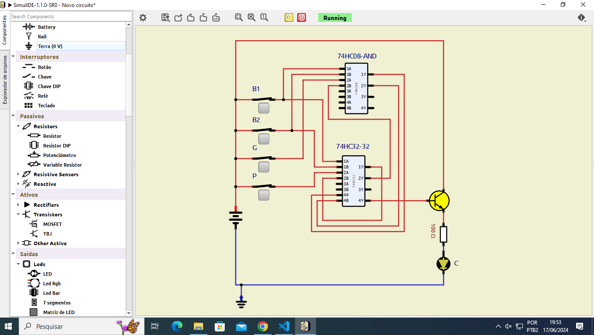

# 1 - Formulação verbal do problema
O cilindro de uma prensa para estampagem deve avançar com, no mínimo, uma das seguintes condições de comando satisfeita:

* Os dois botões manuais devem estar acionados
* A grade de proteção deve estar fechada e o pedal acionado
* A grade de proteção deve estar fechada e um dos dois comandos manuais deve estar acionado

# 2- Elaboração de uma tabela de correspondência lógica

| Variável       | Notação | Tipo    | Correspondência lógica         |
| -              | -       | -       | -                              |
| Botão manual 1 | $B_1$   | Entrada | Botão pressionado -> $B_1 = 1$ |
| Botão manual 2 | $B_2$   | Entrada | Botão pressionado -> $B_2 = 1$ |
| Grade          | $G$     | Entrada | Grade fechada ->  $G = 1$      |
| Pedal          | $P$     | Entrada | Pedal pressionado -> $P = 1$   |
| Cilindro       | $C$     | Saída   | Cilindro avançado -> $C = 1$   |

# 3 - Elaboração de uma tabela verdade
Quantidade de variáveis de entrada = 4 

Número de combinações possíveis entre as variáveis de entrada: $2^4 = 16$ combinações

| $B_1$ | $B_2$ | $G$ | $P$ | $C$ |
| - | - | - | - | - |
| 0 | 0 | 0 | 0 | 0 |
| 0 | 0 | 0 | 1 | 0 |
| 0 | 0 | 1 | 0 | 0 |
| 0 | 0 | 1 | 1 | 1 |
| 0 | 1 | 0 | 0 | 0 |
| 0 | 1 | 0 | 1 | 0 |
| 0 | 1 | 1 | 0 | 1 |
| 0 | 1 | 1 | 1 | 1 |
| 1 | 0 | 0 | 0 | 0 |
| 1 | 0 | 0 | 1 | 0 |
| 1 | 0 | 1 | 0 | 1 |
| 1 | 0 | 1 | 1 | 1 |
| 1 | 1 | 0 | 0 | 1 |
| 1 | 1 | 0 | 1 | 1 |
| 1 | 1 | 1 | 0 | 1 |
| 1 | 1 | 1 | 1 | 1 |

# 4 - Obtenção da equação booleana simplificada
Mapa de Veitch-Karnaugh

|  | $\overline{G}$ $\overline{P}$ | $\overline{G}$ $P$ | $G$ $P$ | $G$ $\overline{P}$ |  |
| - | -  | -  | -  | -  | -                               |
|   | 00 | 01 | 11 | 10 |                                 |
|00 | 0  | 0  | 1  | 0  | $\overline{B_1}$ $\overline{B_2}$|
|01 | 0  | 0  | 1  | 1  | $\overline{B_1}$ $B_2$          |
|11 | 1  | 1  | 1  | 1  | $B_1$ $B_2$                     |
|10 | 0  | 0  | 1  | 1  | $B_1$ $\overline{B_2}$           |

$$C = C_1 + C_2 + C_3 + C_4$$

$$C_1 = G * P$$

$$C_2 = B_1 * B_2$$

$$C_3 = B_2 * G$$

$$C_4 = B_1 * G$$

$$C = (G * P) + (B_1 * B_2) + (B_2 * G) + (B_1 * G)$$

$$C = (B_1 * B_2) + G * (P + B_1 + B_2)$$

# 5 - Elaboração de um fluxograma lógico
SimulIDE


# 6 - Projeto da execução física do sistema
TinkerCAD


# 7 - Programação
```c++
#define botao1 2
#define botao2 3
#define grade 4
#define pedal 5
#define cilindro 7

int B_1 = 0;
int B_2 = 0;
int G = 0;
int P = 0;
int C = 0;

void setup() {
    pinMode(botao1, INPUT);
    pinMode(botao2, INPUT);
    pinMode(grade, INPUT);
    pinMode(pedal, INPUT);
    pinMode(cilindro, OUTPUT);
}

void loop() {
    B_1 = digitalRead(botao1);
    B_2 = digitalRead(botao2);
    G = digitalRead(grade);
    P = digitalRead(pedal);

    // aplicar a equação booleana
    // AND-> &&
    // OR -> ||
    C = ((B_1 && B_2) || (G && (B_1 || B_2 || P)));
    if (C) {
        digitalWrite(cilindro, 1);
    } else {
        digitalWrite(cilindro, 0);
    }
}
```
